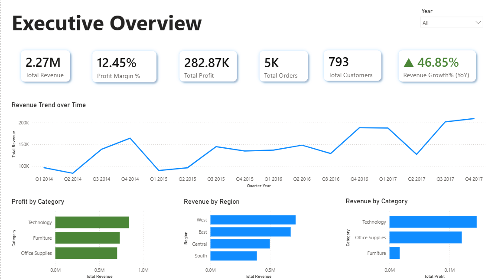
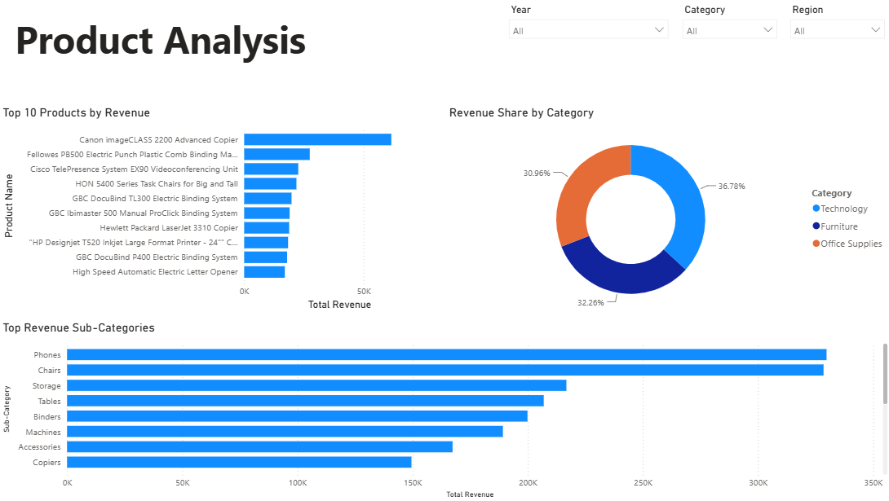
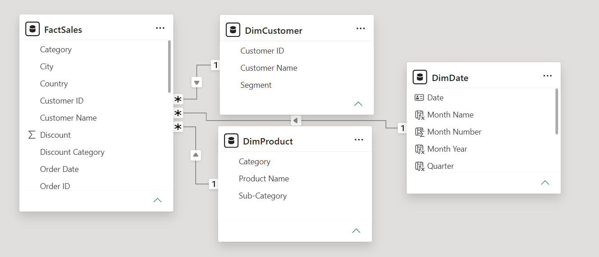

# Retail Sales Analytics Dashboard (Power BI)

## Project Overview

This project presents a Retail Sales Analytics Dashboard built using Microsoft Power BI.

The dashboard provides insights into sales performance, profitability, customer behavior, product performance, and regional trends through interactive visualizations and KPIs.

---

## Objectives

- Analyze overall business performance
- Track revenue and profit trends
- Identify top-performing products
- Compare regional sales performance
- Evaluate category and sub-category contribution
- Enable interactive filtering and exploration

---

## Tools Used

- Microsoft Power BI
- Power Query
- DAX (Data Analysis Expressions)

---

## Data Model

The project follows a Star Schema design.

### Fact Table

- FactSales

### Dimension Tables

- DimDate
- DimProduct
- DimCustomer

Relationships were created between dimension tables and the central fact table to support efficient reporting and filtering.

---

## Dashboard Pages

### 1. Executive Overview

Key business KPIs:

- Total Revenue
- Total Profit
- Profit Margin %
- Total Orders
- Total Customers
- Revenue Growth %

Visuals:

- Revenue Trend Over Time
- Revenue by Region
- Revenue by Category
- Profit by Category

---

### 2. Product Analysis

Product-focused insights:

- Top 10 Products by Revenue
- Revenue Share by Category
- Top Revenue Sub-Categories

Interactive filters:

- Year
- Category
- Region

---

## Key Metrics

### Total Revenue

```DAX
Total Revenue = SUM(FactSales[Revenue])
```

### Total Profit

```DAX
Total Profit = SUM(FactSales[Profit])
```

### Profit Margin %

```DAX
Profit Margin % =
DIVIDE([Total Profit],[Total Revenue],0) * 100
```

### Total Orders

```DAX
Total Orders =
DISTINCTCOUNT(FactSales[Order ID])
```

### Total Customers

```DAX
Total Customers =
DISTINCTCOUNT(FactSales[Customer ID])
```

---

## Features

- Interactive slicers
- Dynamic KPI cards
- Star schema data model
- DAX-based calculations
- Product and category analysis
- Regional performance tracking

---

## Dashboard Preview

### Executive Overview



### Product Analysis



### Data Model



---

## Author

Shreyansh Kumar

B.Tech (Computer Science & Communication Engineering)

KIIT University
